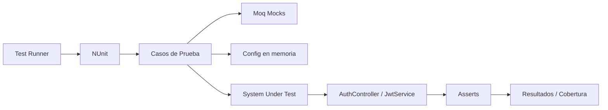
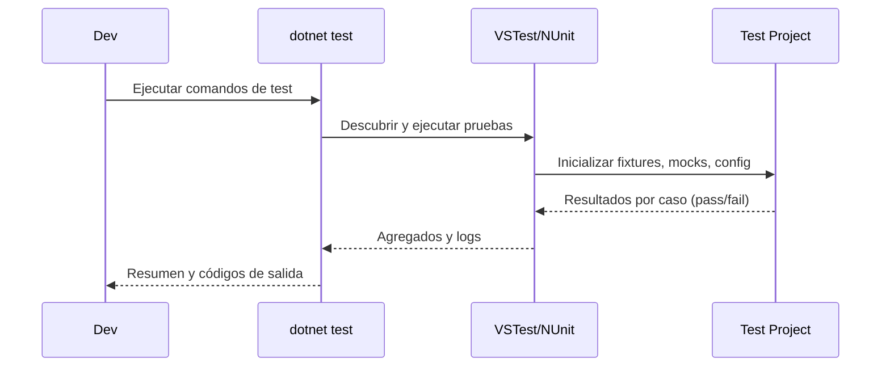
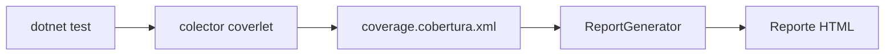
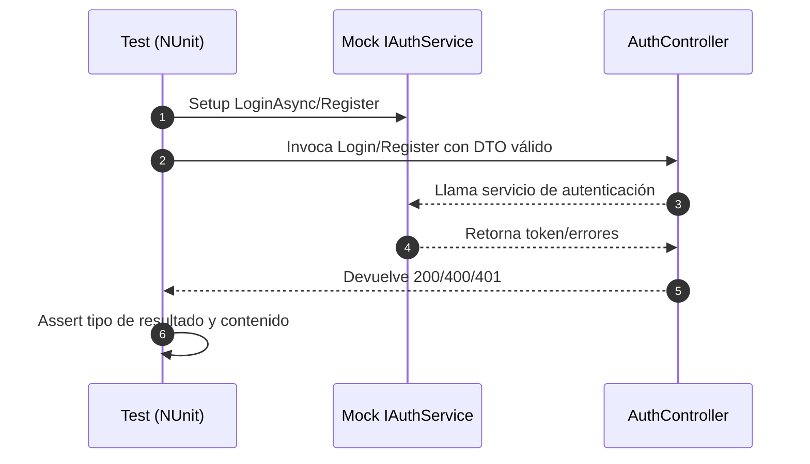
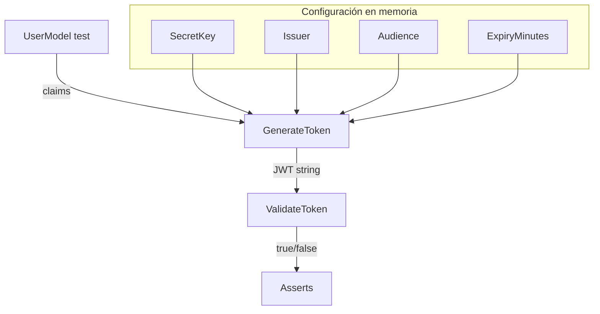
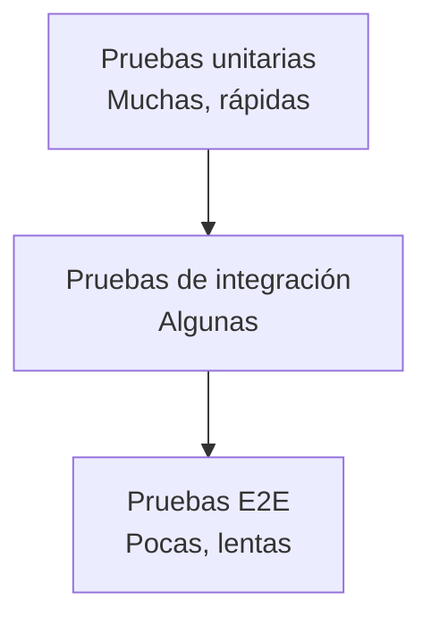
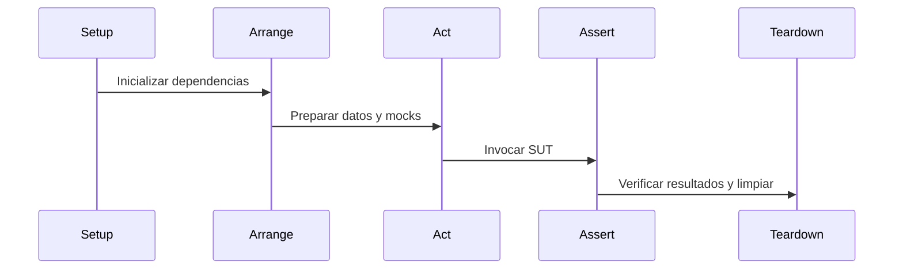

# RealEstate.Tests


Suite de pruebas automatizadas para el backend RealEstate.API (ASP.NET Core). Valida autenticación, servicios y contratos públicos de la API con pruebas unitarias rápidas y deterministas.

## Arquitectura de pruebas
- Pruebas unitarias de controladores y servicios.
- Aislamiento con Moq para simular dependencias (servicios, validadores).
- Configuración en memoria donde aplica (por ejemplo, claves JWT en JwtService).
- Sin dependencias externas (BD/colas); ejecución rápida y determinista.

Diagrama — Arquitectura de pruebas


Explicación: los casos de prueba usan Moq y configuración en memoria para aislar dependencias, ejecutan el sistema bajo prueba (controladores/servicios) y validan resultados con FluentAssertions. La salida se consolida en resultados y cobertura.

## Estructura del proyecto
- `Controllers/AuthControllerTests.cs` — pruebas de login y registro.
- `Services/JwtServiceTests.cs` — pruebas de generación y validación de JWT.
- `RealEstate.Tests.csproj` — configuración del proyecto de pruebas (TFM, paquetes, referencia a la API).
- `RealEstate.Tests.sln` — solución con el proyecto de pruebas.

## Requisitos
- SDK de .NET 9 instalado (`dotnet --info` debe mostrar 9.x).
- Windows, macOS o Linux.

## Preparación
- Restaurar paquetes: `dotnet restore`
- Compilar pruebas: `dotnet build`
- Nota: si la API está corriendo, compilar con `-p:BuildProjectReferences=false` o usar `--no-build` al ejecutar pruebas.

## Guía rápida — API (ejecución)
1. Configurar variables de entorno mínimas (ejemplo Windows PowerShell):
   - `$env:JWT_SECRET="SuperSecret"`
   - `$env:JWT_ISSUER="RealEstateAPI"`
   - `$env:JWT_AUDIENCE="UsuariosAPI"`
   - `$env:JWT_EXPIRY_MINUTES="60"`
   - `$env:MONGO_CONNECTION="mongodb://localhost:27017"`
   - `$env:MONGO_DATABASE="RealEstate"`
   - (opcional) `$env:ASPNETCORE_URLS="http://localhost:5000"`
2. Ejecutar en desarrollo:
```
cd ..\RealEstate.API
dotnet run
```
   - La API arranca en `http://localhost:5000` si `ASPNETCORE_URLS=http://localhost:5000` (o en las URLs que muestre la consola).
3. Prueba rápida (desde otra terminal):
   - Registro: `POST http://localhost:5000/api/auth/register`
   - Login: `POST http://localhost:5000/api/auth/login`
4. Publicar para producción:
```
cd ..\RealEstate.API
dotnet publish -c Release -o publish
```

Resultados esperados (API)
- 200 OK en operaciones válidas (registro/login) según reglas del controlador.
- 400 BadRequest en validaciones fallidas (DTO/servicio), con detalles de errores.
- 401 Unauthorized en credenciales inválidas.
- 500 InternalServerError para errores no controlados.

## Ejecución de pruebas
- Ejecutar todas las pruebas: `dotnet test`
- Ejecutar sin reconstruir dependencias: `dotnet test --no-build`
- Evitar recompilar la API en ejecución: `dotnet test -p:BuildProjectReferences=false`
- Ejecutar la solución: `dotnet test .\RealEstate.Tests.sln`
- Verbosidad de salida: `dotnet test -v minimal | normal | detailed | diagnostic`
- Registrar resultados (TRX): `dotnet test --logger "trx;LogFileName=TestResults.trx"`

Diagrama — Flujo de ejecución


Explicación: `dotnet test` invoca VSTest/NUnit para descubrir y ejecutar pruebas, inicializa el contexto y devuelve resultados y logs al desarrollador.

### Filtrado de pruebas
- Por clase: `dotnet test --filter FullyQualifiedName~AuthControllerTests`
- Por método: `dotnet test --filter Name~Login_ShouldReturnOkWithToken`
- Por namespace: `dotnet test --filter FullyQualifiedName~RealEstate.Tests.Services`

## Cobertura de código
- Generar cobertura (Cobertura XML): `dotnet test --collect:"XPlat Code Coverage"`
- Resultado: `TestResults/<GUID>/coverage.cobertura.xml`
- HTML con ReportGenerator:
  - Instalar herramienta: `dotnet tool install --global dotnet-reportgenerator-globaltool`
  - Generar: `reportgenerator -reports:TestResults/**/coverage.cobertura.xml -targetdir:coverage -reporttypes:Html`
  - Abrir: `coverage\index.html`

Diagrama — Pipeline de cobertura


Explicación: el colector coverlet genera un XML en formato Cobertura que luego se convierte a HTML con ReportGenerator para su lectura.

## Casos cubiertos actualmente
- AuthController
  - Login válido devuelve 200 y token.
  - Login inválido devuelve 401 cuando el servicio lanza InvalidOperationException.
  - Registro válido devuelve 200.
  - Registro con errores de validación del servicio devuelve 400.
- JwtService
  - Generación de token con claims esperados.
  - Validación devuelve true para tokens válidos.
  - Validación devuelve false para tokens inválidos.

Flujo — AuthController


Explicación: los tests controlan el comportamiento del servicio mediante mocks y verifican el código de estado y contenido devuelto por el controlador.

Flujo — JwtService


Explicación: se configuran claves y metadatos JWT en memoria para emitir y validar tokens de forma determinista en pruebas.

## Estrategia de pruebas
- Enfoque de pirámide: muchas pruebas unitarias, algunas de integración, pocas E2E.
- Priorizar pruebas rápidas y aisladas para feedback continuo.

Diagrama — Pirámide de pruebas


Explicación: la base son pruebas unitarias (rápidas y numerosas), seguidas por integración y un tope reducido de pruebas extremo a extremo.

Diagrama — Ciclo de vida de una prueba


Explicación: cada prueba inicializa su contexto, prepara datos, invoca el SUT y valida los resultados, finalizando con limpieza cuando aplica.

## Integración con RealEstate.API
- Referencia de proyecto: `..\RealEstate.API\RealEstate.API.csproj`.
- Mismo TargetFramework: `net9.0`.
- Si la API está en ejecución, usar `-p:BuildProjectReferences=false`.

## Convenciones de pruebas
- Estructura Arrange → Act → Assert en cada caso.
- Asserts con FluentAssertions.
- Dobles de prueba con Moq.
- Nomenclatura: `Metodo_Escenario_ResultadoEsperado`.

## Resultados esperados (pruebas)
- Ejecución exitosa (ejemplo):
  - Correctas! - Con error: 0, Superado: 7, Omitido: 0, Total: 7
  - Datos adjuntos: `TestResults/<GUID>/coverage.cobertura.xml`
- API bloqueada al compilar:
  - Error MSB3021/MSB3027 al copiar RealEstate.API.exe (archivo en uso)
  - Solución: `dotnet test -p:BuildProjectReferences=false` o detener la API
- Error de prueba:
  - Mensaje y stack trace en consola; usar `-v detailed` para más contexto

## Solución de problemas
- API en ejecución bloquea la compilación: `dotnet test -p:BuildProjectReferences=false`.
- SDK incompatible: instalar .NET 9 o ajustar `<TargetFramework>`.
- Restauración: `dotnet restore` en `RealEstate.Tests/`.
- Rutas con espacios: ejecutar comandos desde la carpeta del proyecto o entrecomillar rutas.

## CI/CD (opcional)
- Ejemplo GitHub Actions (Windows/Ubuntu):
  - `actions/setup-dotnet` con `dotnet-version: 9.x`
  - `dotnet restore`
  - `dotnet test --collect:"XPlat Code Coverage" -v minimal`
  - `actions/upload-artifact` con ruta `TestResults/**/coverage.cobertura.xml`

